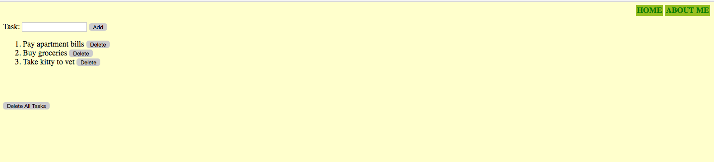

TODO-list App
=============
A todo-list app written using Django Web framework.  

To run
------
```sh
$ python manage.py migrate
$ python manage.py runserver
```

Screenshot
----------


Author
------
Deep Aggarwal  
deep.uiuc@gmail.com  
